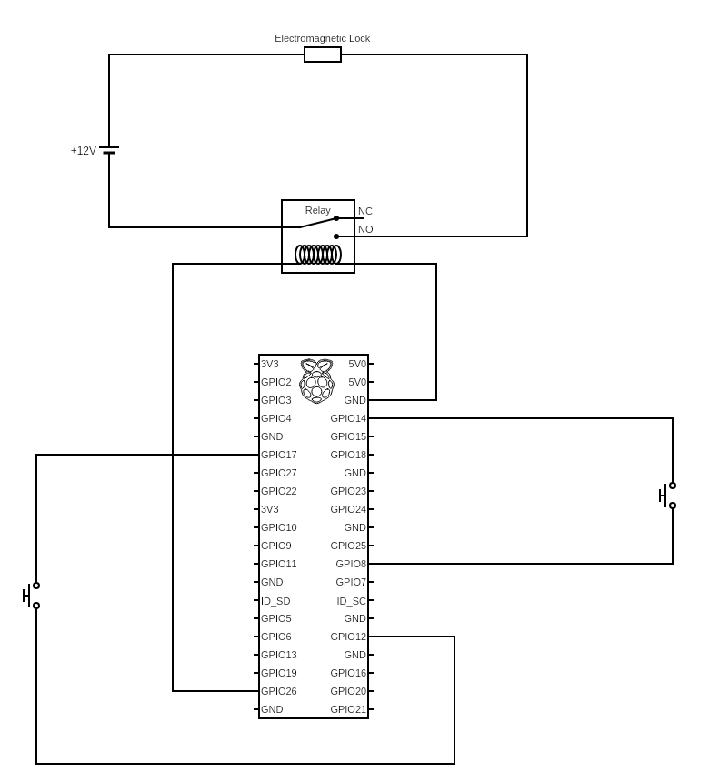
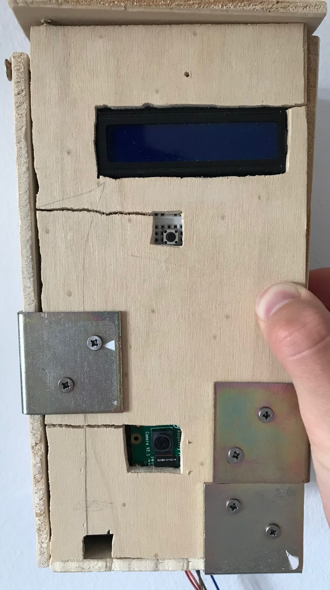
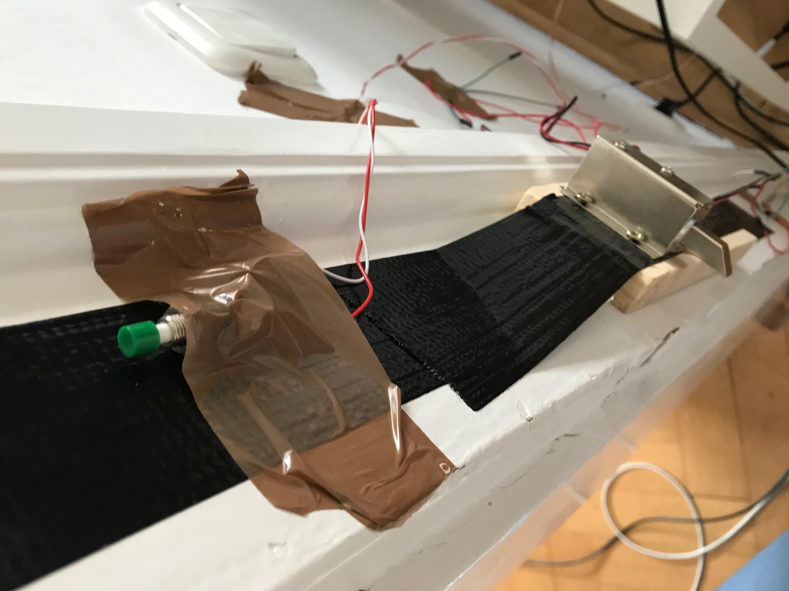
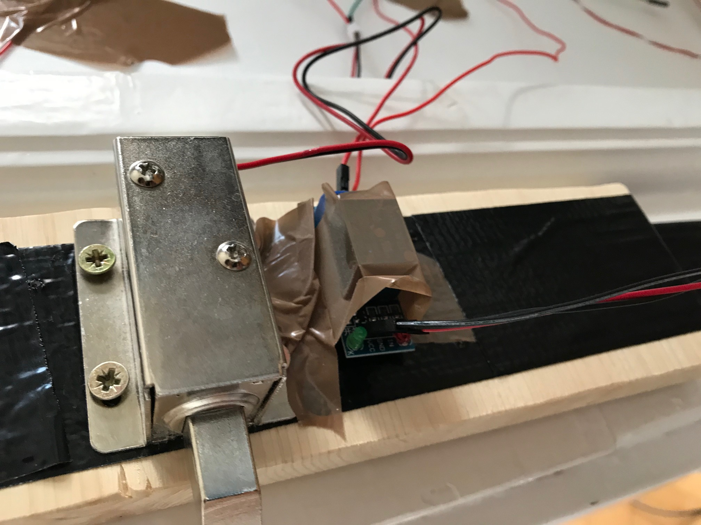

# Smart door
## Door lock with Face Recognition (feat. Raspberry Pi 3b+)

### What does the code do?

With this code the Raspberry Pi will detect button input to do a face recognition test.

Then if the face is recognized it will switch on a relay to pull back the electromagnetic door lock lever which will enable you to open the door.

If you have entered the room you need to click the other button which is located on the inside of the room to close the lock again as soon as you have closed the door again.

When you want to get out again just press this button again and the lock will open.

To close the lock from the outside just press the button that is located on the outside.

During the whole time the code is running the connected LCD display will show useful information. Note that in order to interact with the LCD display I needed this `lcddriver.py` script which is made only for my specific display model so you might have to handle your display a little different.

### How I implemented it

This was implemented using 2 push button switches one on the inside and one on the outside of the door.

For the outside the output GPIO pin 17 and the input pin 12 were used to detect when the button is pressed.

On the inside I used the pin 14 as output and pin 8 as the input detector.

To unlock the door either if the face was recognized after pressing the outside button or if the inside button was pressed pin 26 which is connected with ground will output its 3.3V to switch the relay. As long as the relay is switched on the electromagnetic lock will stay open since the 12V voltage will pull its iron core back and as soon as the inside or outside button will be pressed again pin 26 will stop outputting its 3.3V and thereby switching the relay off. As a result of the 12V door lock circuit being interrupted that way the lock will close again. 

Everything described above can also be seen very well in this circuit diagram:

### Some Images

Raspberry Pi + Camera + LCD Display on the outside of the door:

Electromagnetic Lock + Relay + Button on the inside of the door:

